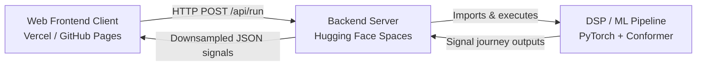

# Telemetry Decoder System Architecture

This document outlines the architecture, data flow, and API contracts for the Telemetry Decoder simulation web application.

## System Components



1. **Frontend Client**:
   * Single-page web application.
   * Styled strictly using the **Meta Design System** (`DESIGN.md`).
   * Visualizes the 4-stage signal journey in time-domain and frequency-domain plots interactively.
   * Renders bit grids for pre-FEC and post-FEC bit-level confidence.

2. **Backend Server**:
   * FastAPI web server (`server/app.py`).
   * Runs in the cloud (Hugging Face Spaces).
   * Dynamically switches the working directory to `./pipeline` at launch to load modules cleanly.
   * Patches model file paths in memory at startup to point to `telemetry_v8_5.pth`.

3. **DSP/ML Core Pipeline**:
   * Transmitter (PCM-FM modulator).
   * Channel (Phase noise, Doppler shift, LNA compression, Carrier Frequency Offset, AWGN, OFDM/tone interference).
   * Receiver (Coarse/fine correlation frame sync, derotation, Conformer Neural Network, Min-Sum LDPC Decoder).

---

## API Protocols & Data Contracts

### 1. HTTP POST `/api/run`

Runs the transceiver-channel-receiver simulation journey for a message.

#### Request JSON Body
```json
{
  "message": "ALTITUDE 35000 SPEED 480",
  "interference": "wideband",
  "sjr_db": 0.0,
  "snr_db": 15.0,
  "seed": 42
}
```

*   `message`: String, max length 128 characters.
*   `interference`: String, one of `none` | `v16_tones` | `wideband` | `tones_cont`.
*   `sjr_db`: Float, signal-to-jammer ratio (clamped between -5.0 and 20.0).
*   `snr_db`: Float, signal-to-noise ratio (clamped between 5.0 and 30.0).
*   `seed`: Optional integer for reproducibility.

#### Response JSON Body
```json
{
  "ok": true,
  "message_sent": "ALTITUDE 35000 SPEED 480",
  "recovered_pre_fec": "AL?I_UDE 350#0 S?EED 4??",
  "recovered_post_fec": "ALTITUDE 35000 SPEED 480",
  "stats": {
    "n_frames": 10,
    "raw_ber": 0.0021,
    "total_raw_errors": 5,
    "errors_corrected_by_fec": 5,
    "sync_err_samples": 1,
    "psl": 1.52,
    "interference": "wideband",
    "sjr_db": 0.0,
    "snr_db": 15.0,
    "seed": 42,
    "simulated": true
  },
  "stages": [
    {
      "id": 1,
      "name": "Transmitted PCM-FM (clean)",
      "time": {
        "i": [0.01, -0.05, 0.12, "... 400 floats total ..."],
        "q": [-0.02, 0.07, -0.09, "... 400 floats total ..."],
        "t_us": [0.0, 0.1, 0.2, "... 400 floats total ..."]
      },
      "spectrum": {
        "freq_mhz": [-5.0, -4.96, "... 256 floats total ..."],
        "psd_db": [-45.1, -47.3, "... 256 floats total ..."]
      }
    },
    { "id": 2, "name": "Interference + noise", "time": { ... }, "spectrum": { ... } },
    { "id": 3, "name": "Received signal (corrupted)", "time": { ... }, "spectrum": { ... } },
    { "id": 4, "name": "Model-reconstructed signal", "time": { ... }, "spectrum": { ... } }
  ],
  "frames": [
    {
      "index": 1,
      "raw_errors": 0,
      "sync_err": 0,
      "psl": 1.6,
      "sent_bits": "100101...",
      "pred_bits": "100101..."
    }
  ]
}
```

---

## Signal Transport Details

To minimize payload transport latency, waveforms are downsampled server-side:
*   **Time Domain**: Only the **first 400 samples** of each stage signal are returned. Real (`i`) and imaginary (`q`) parts are packed along with a microseconds time vector (`t_us`).
*   **Frequency Domain**: The server computes the Power Spectral Density (PSD) over the **full 2560 samples** using an FFT, then downsamples the resulting spectrum to **256 points** covering a frequency span of $\pm 5\text{ MHz}$.
