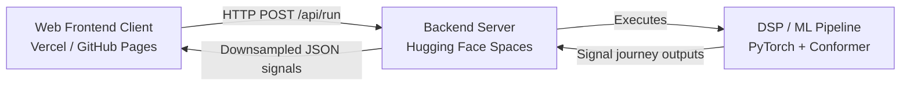

# Telemetry Decoder Simulator

A deep-learning PCM-FM radio receiver that recovers aircraft telemetry data (altitude, speed, heading) even when co-channel 5G/LTE cellular interference is stronger than the signal itself—something traditional receivers fail to do.

Demonstrated in a high-fidelity simulated RF channel environment.

---

## Technical Highlights
* **Core DSP & Deep Learning Pipeline**: Features coarse/fine correlation frame sync, carrier frequency offset (CFO) estimation, a frequency-domain **SpectralGate** excision layer, a **ResBlock U-Net** waveform reconstructor, a 4-layer **Conformer Network** for temporal modeling, and a vectorized **Min-Sum LDPC Decoder** (Rate-1/2, n=2046, k=1025) with LLR temperature calibration.
* **Premium User Interface**: Engineered as a responsive Single Page Application (SPA). Includes:
  * **Pill-shaped LLM Input**: A clean, Gemini/ChatGPT-style prompt interface for typing telemetry sentences.
  * **Collapsible Config Drawer**: Allows dynamic adjustment of Signal-to-Noise Ratio (SNR), Signal-to-Jammer Ratio (SJR), and random channel seeds.
  * **Dynamic Canvas Rendering**: Waveforms are plotted in real-time on HTML5 canvases using coordinates sent via JSON (reducing heavy network payloads).
  * **Comparative Output Banner**: Visualizes a live side-by-side comparison of the Conformer model against a traditional receiver.
  * **Bit-level Verification Grid**: Inspects frame-by-frame raw bit diffs.

---

## System Architecture



---

## Local Setup & Development

### 1. Backend Server Setup
Ensure you have Python 3.10+ installed.

1. Navigate to the server folder or use the root:
   ```bash
   pip install -r server_reference/requirements.txt
   ```
   *Note: For faster CPU installations, install the CPU-only PyTorch build:*
   ```bash
   pip install --index-url https://download.pytorch.org/whl/cpu torch>=2.0
   ```

2. Run the FastAPI development server:
   ```bash
   uvicorn server.app:app --host 0.0.0.0 --port 7860 --reload
   ```
   *The server is now live at `http://127.0.0.1:7860`.*

### 2. Frontend client Setup
The frontend is a static web application and can be served using any local server.

* **Using Node.js**:
  ```bash
  npx serve frontend
  ```
* **Using Python**:
  ```bash
  python -m http.server 8000 --directory frontend
  ```
  Open `http://localhost:8000` in your web browser.

---

## Cloud Deployment Guide

To deploy the application in a 100% free hosting tier, we decouple the static frontend client from the machine learning backend.

### Step 1: Deploy Backend API to Hugging Face Spaces (Free 16GB RAM)
Hugging Face Spaces provides container hosting. Because PyTorch models require significant memory, Hugging Face prevents the Out-Of-Memory (OOM) crashes typical of standard free platforms.

1. **Create Account**: Sign up at [Hugging Face](https://huggingface.co).
2. **Create Space**: Select **Create New Space**, type a name, choose the **Docker** SDK (Blank template), and keep the visibility public.
3. **Execute Deploy Script**: Run the helper script included in this repository:
   ```bash
   chmod +x deploy.sh
   ./deploy.sh
   ```
   Paste your Space's Git URL (e.g. `https://huggingface.co/spaces/your-username/your-space-name`) when prompted.
4. **Monitor Build**: Monitor the container creation in the Hugging Face Space dashboard.

### Step 2: Deploy Frontend UI to Vercel or GitHub Pages
Since the frontend consists of static assets, it can be hosted on Vercel:

1. **Install Vercel CLI** (if not already installed):
   ```bash
   npm install -g vercel
   ```
2. **Configure API Endpoint**:
   Open `frontend/app.js` and update the production API mapping if necessary, or let it connect to your Hugging Face Space domain.
3. **Deploy via CLI**:
   Navigate to the root directory and execute:
   ```bash
   vercel
   ```
   * Select `Yes` to set up the project.
   * Choose your account scope.
   * Do **not** link to an existing project (select `No` to create a new one).
   * Project name: `telemetry-decoder-ui`
   * Directory: Select `./` or the path to your project.
   * Under settings, modify the Output Directory to `frontend`.
4. **Go Live**: Run `vercel --prod` to deploy to production.
